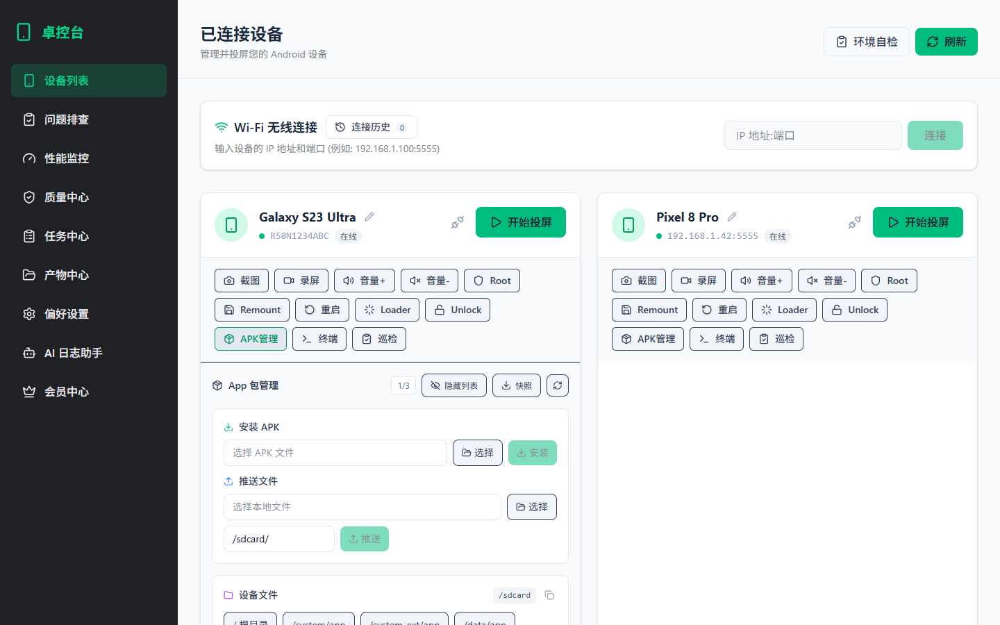
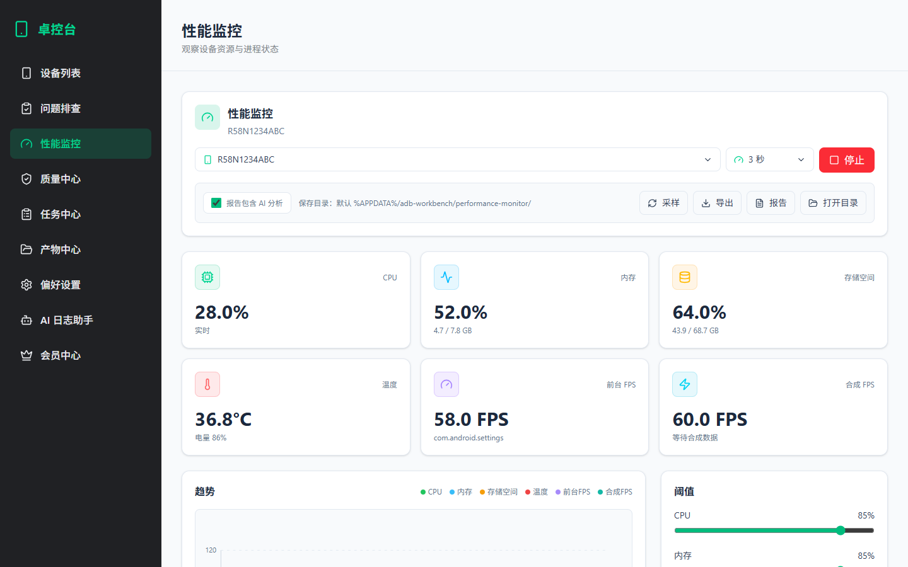
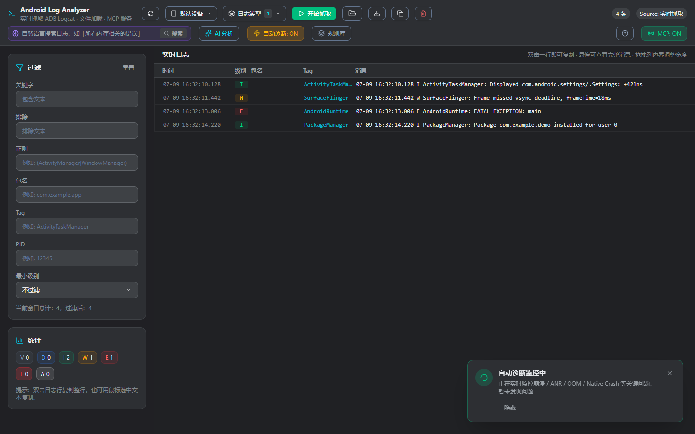
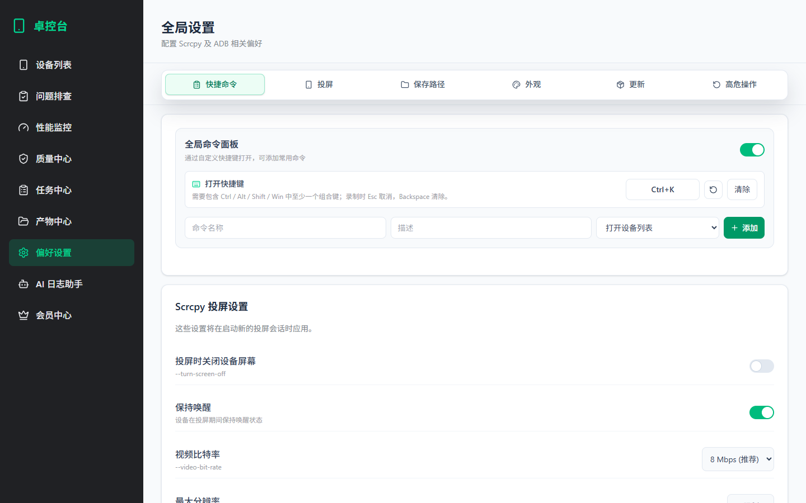
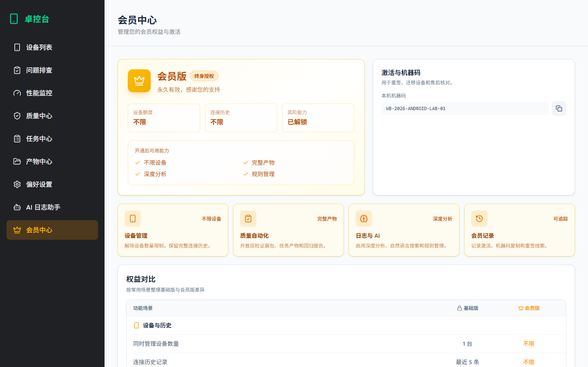

# 卓控台

> 基于 Electron + React 19 + TailwindCSS 构建的 Android 设备全生命周期管理桌面工具，封装 `adb`、`scrcpy`、日志分析、性能监控、质量自动化、产物管理、会员授权与 OTA 更新能力。



## 核心能力

### 设备管理与 APK 管理

自动识别 USB / Wi-Fi ADB 设备，并为每台设备提供投屏、截图、录屏、音量、Root、Remount、重启、Loader、Unlock、终端、巡检和 APK 管理入口。

- USB / Wi-Fi 设备列表、连接历史和一键重连
- `scrcpy` 投屏参数统一配置，支持截图与录屏保存路径设置
- APK 安装、推送、包名搜索、系统应用筛选、批量选择、应用详情和快照
- APK 应用列表支持隐藏/显示搜索区，并持久化用户偏好
- 设备文件浏览、拉取、推送和常用目录快捷入口

### 性能监控、质量与产物



- 实时采样 CPU、内存、存储、温度、前台 FPS 和合成 FPS
- 支持采样间隔、阈值、导出、AI 分析报告和产物目录打开
- 质量中心提供回归基线、验收任务、设备巡检和证据包能力
- 任务中心支持复现脚本、多设备批量执行和运行历史
- 产物中心统一查看问题排查、巡检、性能和任务报告

### AI 日志助手与 MCP 服务



- 独立日志分析窗口支持实时 logcat、文件加载、多维过滤和导出
- 内置 Crash / ANR / OOM / Native Crash 自动诊断和规则库
- AI 深度分析支持流式输出、Markdown 渲染、多轮追问和报告导出
- MCP 服务默认运行在 `http://127.0.0.1:49321/mcp`
- 外部 AI 工具可调用设备列表、包列表、性能采样、巡检和日志分析等工具

### 偏好设置与 OTA 更新



- 偏好设置按快捷命令、投屏、保存路径、外观、更新和高危操作分组
- 固定分组导航支持阴影分层和页内快速跳转
- 支持截图、录屏、巡检、性能、任务中心和质量中心保存路径配置
- 内置自动更新检查、下载进度、安装重启和更新说明弹窗
- 高危操作确认支持记忆选择和统一重置

### 会员中心



- 基础版/会员版权益对比按使用场景分组展示
- 会员版开放不限设备、完整连接历史、完整产物、规则管理和深度分析
- 支持本机机器码复制、激活码录入、激活记录和复制历史

## 环境要求

使用前请确保系统已安装以下依赖，并已加入 `PATH`：

1. [Node.js](https://nodejs.org/)
2. [ADB (Android Debug Bridge)](https://developer.android.com/studio/releases/platform-tools)
3. [scrcpy](https://github.com/Genymobile/scrcpy)

Windows 用户可直接使用项目内置的 `scrcpy-win64` 目录，或安装官方 scrcpy 并配置环境变量。

## 安装与运行

### 下载安装包

从 [GitHub Releases](https://github.com/xiandan001/adb-workbench/releases) 下载最新版安装包，双击安装即可使用。

### 源码运行

```bash
npm install
npm run electron:dev
```

### 构建安装包

```bash
npm run electron:build
```

构建完成后，安装包、`.blockmap` 和 `latest.yml` 会输出到 `release/` 目录，用于桌面安装与 OTA 更新。

## 技术栈

| 类别 | 技术 |
| --- | --- |
| 框架 | Electron + React 19 |
| 构建 | Vite + electron-builder |
| 样式 | TailwindCSS 4 |
| 设备能力 | adb、scrcpy |
| 更新 | electron-updater |
| 协议 | MCP（Model Context Protocol） |

## 项目结构

```text
adb-workbench/
├── electron/              # Electron 主进程、IPC、自动更新、ADB 能力
├── src/                   # React 渲染进程
│   ├── App.jsx            # 主窗口
│   ├── components/        # 设备、日志、性能、质量、任务、会员等模块
│   ├── data/              # 主题、命令、更新日志
│   └── shared/            # 共享工具
├── docs/                  # README 截图与文档资产
├── scrcpy-win64/          # Windows 内置 scrcpy + adb
└── electron-builder.json  # 打包配置
```

## License

MIT
